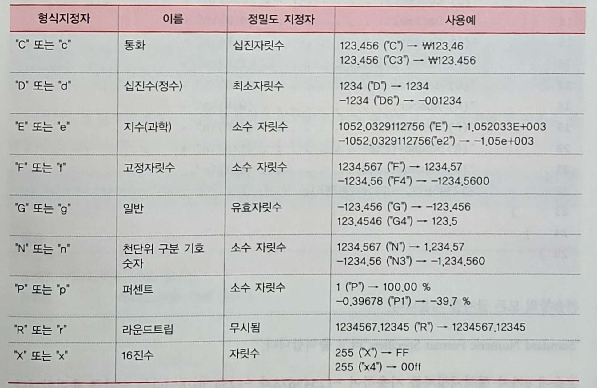

### 대입연산자와 대입문
- `=` 연산자의 오른쪽은 `rhs(right hand side) value`, 왼쪽은 `lhs(left hand side) identifier`라고 함
	- rhs에는 변수, 값, 수식 등이 올 수 있으나 lhs에는 변수만 올 수 있음
- Cast(캐스트): 어떠한 자료형을 또 다른 자료형으로 변환하는 형변환

<br />

***

### Console.WriteLine 메소드
- `m`은 `decimal` 형의 접미사

<br />

***

### Console.WriteLine 메소드로 여러 개의 값을 출력
- 형식(format) 정보를 사용
```
Console.WriteLine(string format, object arg0, object arg1, ...)

// 예시
string primes;
primes = String.Format("10 이하의 소수: {0}, {1}, {2}, {3}", 2, 3, 5, 7);
Console.WriteLine(primes);
```

<br />

***

### 두 변수를 출력하는 방법
1. 두 개 변수의 값을 각각 문자열로 바꿔 연결해서 하나의 문자열로 출력하는 방법
```
Console.WriteLine(v1.ToString() + ", " + v2.ToString());
Console.WriteLine("v1 = " + v1 + ", v2 = " + v2);
```

2. 형식 정보를 사용해 여러 개의 변수나 값을 출력하는 방법
```
Console.WriteLine("v1 = {0}, v2 = {1}, v1, v2);
```

3. 형식문자열 앞에 `$` 기호를 사용하는 문자열 보간(string interpolation) 방법
```
Console.WriteLine($"v1 = {v1}, v2 = {v2}");
```

<br />

***

### 형식지정자를 사용한 Console.WriteLine 메소드
- 형식지정자의 표현 : `Axx` (A: 형식, xx: 정밀도)
    - 정밀도는 0~99의 값을 가지며 결과값의 자릿수에 영향을 줌
    - 가장 많이 사용되는 표준 숫자 형식지정자
    
- 사용 예시
```
Console.WriteLine("{0:D}", -12345678);  // 결과: -12345678
```

- 형식 지정자와 함께 정밀도 지정자를 사용
```
decimal value = 123456.789m;
Console.WriteLine("잔액은 {0:C2}원 입니다.", value);    // 결과: 잔액은 \\123,456.79원 입니다.
Console.WriteLine("잔액은 {0,20:C2}원 입니다.", value); // 결과: 잔액은           \\123,456.79원 입니다.
```
