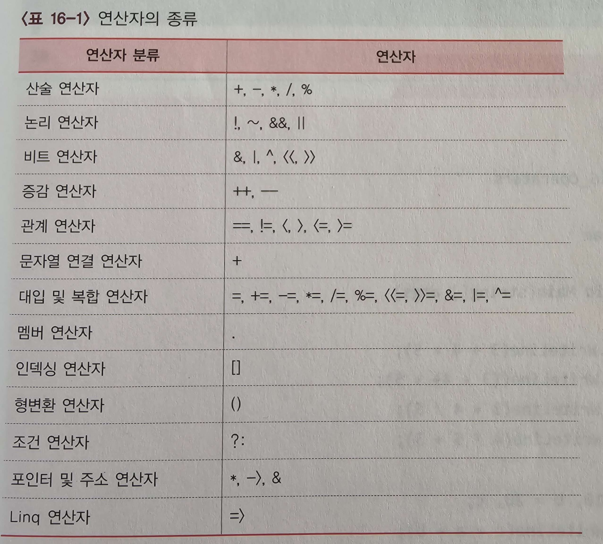

### C#의 연산자와 식
- 연산자의 종류

	- 연산자는 중복되어 사용될 수 있음 == 하나의 기호가 여러가지 기능을 할 수 있음(오버로딩)

---

### 산술연산자
- `정수/정수`의 결과는 정수, `정수/실수`의 걸과는 실수
- C/C++과 달리 C#은 실수에 %연산자를 사용할 수 있음

---

### DivideByZeroException과 try~catch문
- 산술 연산에서 나올 수 있는 예
1. 0으로 나눔 예외(DivideByZeroException)
- 실수를 0으로 나눌 때에는 예외가 아니고 무한대를 출력함
- 정수를 0으로 나눌 때 `나눔 예외` 발생

<br />

- 나누기 계산을 할 시 분모 변수에 어떤 값이 들어올지 모르므로 예외 처리를 위해  try~catch문을 사용
- 사용 예시
```
try
{
    Console.WriteLine(x / y);
}
catch(Exception e) {
    Console.WriteLine(e.Message);  // Exception 클래스의 Message 속성
}
```
<br />

###
2. 오버플로우 예외(OverflowException), checked 키워드
- 정수 연산에서 MaxValue 값에 1 이상을 더하면 overflow 되어 엉뚱한 값을 출력함
- checked 사용 예시
```
static void Main(string[] args) {
    int x = int.MaxValue, y = 0;

    checked
    {
        try
        {
            y = x + 10;
        }
        catch (Exception e)
        {
            Console.WriteLine(e.Message);
        }
    }
    Console.WriteLine("int.MaxValue + 10 = {0}", y);
}
```

- checked 키워드를 사용하면 오버플로 예외를 발생시킴, checked 미사용 시 디폴트로 unchecked 상태가 되어 결과의 가장 중요한 비트(MSB)가 무시되고 실행이 계속됨
- 산술 연산자 외에도 정수 계열 형식 간 캐스팅(ex: long to int)은 오버플로를 발생시킴
- 비트 연산자와 시프트 연산자는 오버플로를 발생시키지 않음
- Decimal 변수의 산술 연산 오버플로는 항상 OverflowException을 throw함 / Decimal을 0으로 나누면 항상 DivideByZeroException이 throw됨
