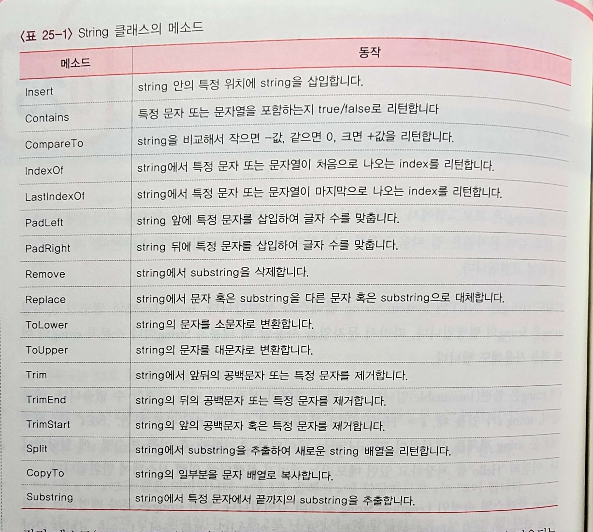
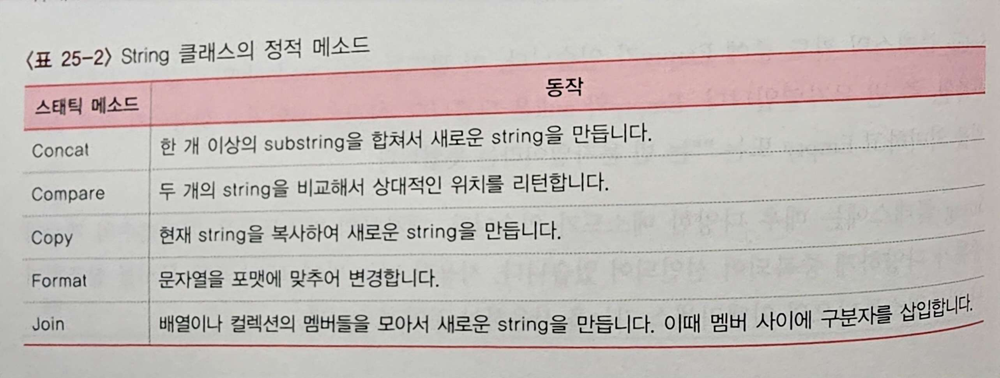

### 논리연산자
- `&&, ||, ^, !`가 있음, `^`는 Exclusive OR을 의미

---

### 비트연산자
- C/C++ 언어와 동일하게 6가지
- 정수형 변수(int, long 등)와 부울형 변수에 대해 비트 수준에서 연산


---

### 증가연산자, 감소연산자와 대입연산자의 압축
- 대입연산자의 압축 시 주의할 점: `x *= y + 3`은 `x = x * (y + 3)`이라는 뜻
	- 이와 같은 압축 표현은 모든 이항연산자에 적용됨
	- 지정연산자라고도 함

---

### String 클래스
- 키워드 `string`은`.NET의 System.String` 클래스와 동일
	- int가 int32의 별명인 것처럼 string이 String의 별명인 것

- C# string은 불변(Immutable)임
	- 값이 존재하는 string s에 새로운 값을 할당하면, .Net 시스템은 새로운 string 객체를 생성해 데이터를 초기화한 후 이를 변수명 s에 할당함
	- 이전 값을 저장하던 메모리는 가비지 콜렉터에 의해 시스템에 반환됨

- Length 속성
	- ex: s.Length
	- a[5] = 'a' 불가

- Empty 필드: static readonly, 값은 길이가 0인 문자열(빈 문자열)
	- Null은 선언되고 할당되지 않은 스트링, Empty 또는 ""는 빈 문자열

- String 클래스의 메소드

- String 클래스의 정적 메소드


<br />

- 예시 코드
```
using System;

namespace A025
{
    class Program
    {
        static void Main(string[] args)
        {
            string s = " Hello, World! ", t;

            Console.WriteLine(s.Length);
            Console.WriteLine(s[8]);
            Console.WriteLine(s.Insert(8, "C# "));
            Console.WriteLine(s.PadLeft(20, '.'));
            Console.WriteLine(s.PadRight(20, '.'));
            Console.WriteLine(s.Remove(6));
            Console.WriteLine(s.Remove(6, 7));
            Console.WriteLine(s.Replace('l', 'm'));
            Console.WriteLine(s.ToLower());
            Console.WriteLine(s.ToUpper());
            Console.WriteLine('/' + s.Trim() + '/');
            Console.WriteLine('/' + s.TrimStart() + '/');
            Console.WriteLine('/' + s.TrimEnd() + '/');

            string[] a = s.Split(',');
            foreach (var i in a)
                Console.WriteLine('/' + i + '/');

            char[] destination = new char[10];
            s.CopyTo(8, destination, 0, 6);
            Console.WriteLine(destination);

            Console.WriteLine('/' + s.Substring(8) + '/');
            Console.WriteLine('/' + s.Substring(8, 5) + '/');

            Console.WriteLine(s.Contains("11"));
            Console.WriteLine(s.IndexOf('o'));
            Console.WriteLine(s.LastIndexOf('o'));
            Console.WriteLine(s.CompareTo("abc"));

            Console.WriteLine(String.Concat("Hi~", s));
            Console.WriteLine(String.Compare("abc", s));
            Console.WriteLine(t = String.Copy(s));

            String[] val = { "apple", "orange", "grape", "pear" };
            String result = String.Join(", ", val);
            Console.WriteLine(result);
        }
    }
}
```
	- CopyTo() 메소드는 스트링의 일부분을 문자 배열로 저장: s.CopyTo(8, destinatiton, 0, 6)은 s의 8번째 인덱스로부터 destination[] 배열의 0번 인덱스(맨앞)로 6개의 문자 "World!"를 복사함
	- String.Join(", ", val)은 string 배열 val의 각 요소를 ", "으로 연결해 리턴
